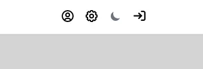
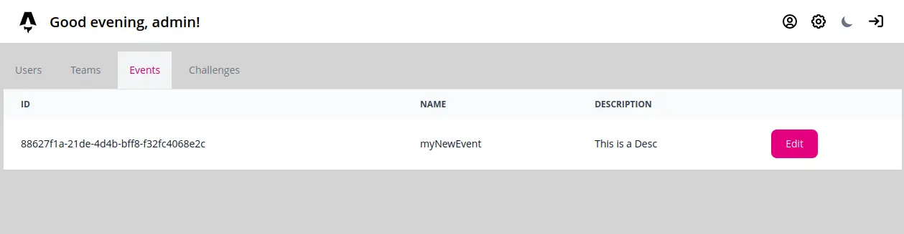
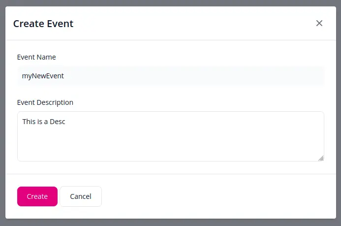
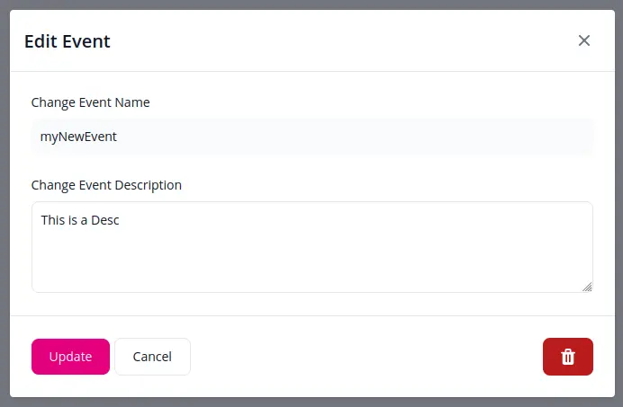
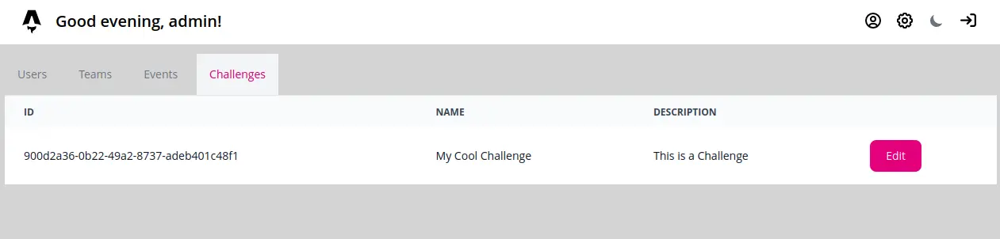
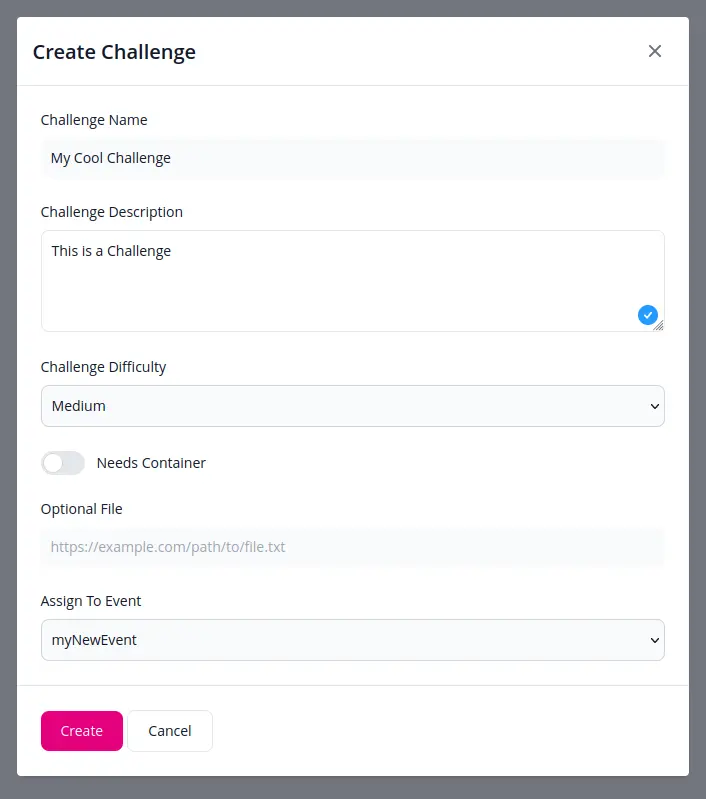
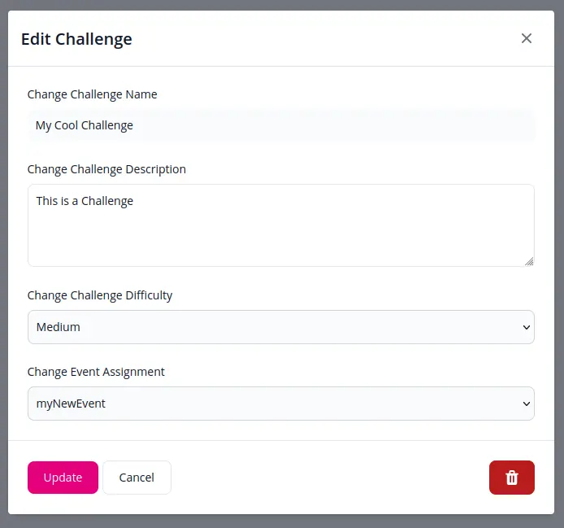
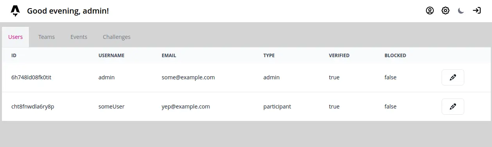
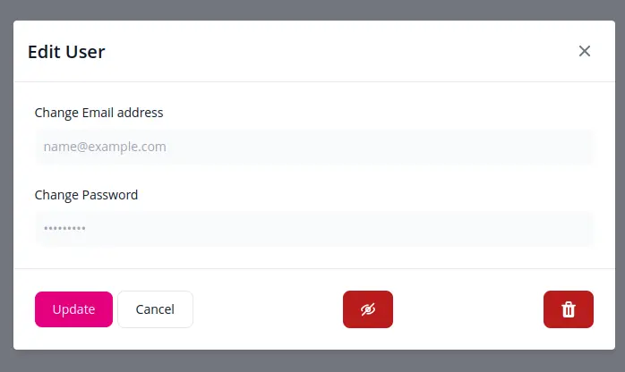

To provide the instance administrator a convenient way to manage challenges, events and users, the CTF-Citadel platform provides a Admin Panel.

## Access to the Panel ##

The panel can be reached by navigation to the settings cog from the top right of the navigation bar.

This icon is only shown if the user is saved and recognized as an admin in the underlying database. 

## Event Management ##

To create and manage events, navigate to the "Events" tab

Use the plus-icon in the bottom right to add new events.

Click on the "Edit" button to edit an existing event.

:::note
Deleting a Event will clear all scores and event data related to it.
:::

## Challenge Management ##

To create and manage challenges, navigate to the "Challenges" tab

Use the plus-icon in the bottom right to add new challenges.

Click on the "Edit" button to edit an existing challenge.

:::note
Challenges need to be bound to an Event, else they can not be created.
:::

## User Management ##

To view users, reset their password or block them, navigate to the "Users" tab

Click on the pencil-icon to edit an existing user.

The "Trash" icon is used to delete a user and the "Eye" icon can be used to block and unblock a user.

## Team Management ##

> ***Coming Soon...***

___

Authors: Teppan F.