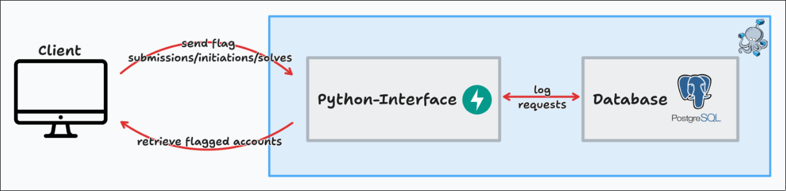

Having an Anti-Cheat System is vital to stop cheating and overall negative behavior. In this case we deploy an additional 2 docker containers just for the anti-cheat. The docker-container includes a **fastapi** endpoint to receive information, process it and provide the processed data, furthermore a **socket** endpoint is being used to fetch data in realtime to a client. **mariaDB** is being leveraged to log flag submissions and initiations.  


The image above shows the overall workflow of the **Anti-Cheat**. The container-stack itself can be implemented anywhere but because there is no authentication implemented yet, it is recommended to only use it locally and not expose its ports because this may leak sensitive information.

## Ways to capture **Flag-Sharing**:
- `Same flag-submission` -> Check if a team submitted the flag of another team. 
- `Same challenge-submissions` -> If the same challenges are submitted in the same order by 2 different teams the teams will be marked as suspicious (the amount of challenges which need to be in order can be changed).
- `Poisoned flags` -> An API endpoint is established to receive flags designated as poisonous. These flags are subsequently disseminated among potential flag-sharing participants to detect and address such behavior.

## Suspicion Level
> The **suspicion level** defines how probable it is that a team is somehow cheating. <br/>
- `lvl 1` -> Cheating is possible but could just be coincidence.
- `lvl 2` -> Cheating is not confirmed but lgos indicate that the team has suspicious events.
- `lvl 3` -> Although partially not fully confirmed, the logs strongly indicate that the team is cheating in some way. Poisoned flags and submitting other teams' flags mark the team as **suspicion lvl 3** because it should fully confirm the unfair behavior.

## Implementation
The Anti-Cheat implements **FastAPI** to capture every flag submissions, initiation and solves. <br/><br/>
The `/submissions` endpoint should receive any flag submission which is wrong to log user flag submissions. 
The flag will be extracted from the request and checked if it belongs to another team or if it is a poisoned flag. 
If any of the requirements are met the user and team will be flagged.
```py
@app.post('/submissions', description='An endpoint to receive flag submissions of users.')
async def submit_flag(flag_submission: dict):
    db = DBSession()
    try:
        # Log submission in database
        db_flag_submission = Submission(**flag_submission)
        db.add(db_flag_submission)
        db.commit()
        db.refresh(db_flag_submission)

        # Check if challenge was solved
        flag_check = db.query(Initiated_Flag).filter(Initiated_Flag.flag == flag_submission.get('flag')).all()
        for entry in flag_check:
            if entry.team_id == flag_submission.get('team_id'):
                solved = Solved(
                    team_id=flag_submission.get('team_id'), challenge_id=flag_submission.get('challenge_id'), timestamp=flag_submission.get('submission_time')
                )
                db.add(solved)
                db.commit()
                db.refresh(solved)

        # Check if submitted flag is poisoned
        if check_poisoned(flag_submission.get('team_id'), flag_submission.get('user_id'), flag_submission.get('challenge_id'), flag_submission.get('flag'), flag_submission.get('submission_time')) == True:
            return {"message": "Poisoned flag detected"}
        
        # Only check for wrong flag submissions if challenge is
        if flag_submission.get('static') == False:
            same_flag_check(flag_submission.get('team_id'), flag_submission.get('user_id'), flag_submission.get('challenge_id'), flag_submission.get('flag'), flag_submission.get('submission_time'))

        return {"message": "Flag submitted successfully"}

    except Exception as e:
        db.rollback()
        raise HTTPException(status_code=500, detail=f"Failed to submit flag: {str(e)}")
    
    finally:
        db.close()
```


<br/>The `/initiate_flag` endpoint should receive flag initiations from dynamic challenges where some kind of service/s is/are being spawned. This is needed to capture cross-teaming during the competition. 
```py
@app.post("/initiate_flag", description='An endpoint to receive the intitiated flags from all teams when challenges are deployed.')
async def initiate_flag(flag_initiation: dict):
    db = DBSession()
    try:
        db_flag_initiation = Initiated_Flag(**flag_initiation)
        db.add(db_flag_initiation)
        db.commit()
        db.refresh(db_flag_initiation)

    except Exception as e:
        raise HTTPException(status_code=500, detail=f"Failed to initiate flag: {str(e)}")
    
    finally:
        db.close()
```

<br/>The `/solved` endpoint should receive challenge solves of any kind. The submitted flag will be checked if it is marked as **poisonous** which will then flag the team. The challenges will be logged with timestamps which will be used to determine the order of challenge submissions and timeframe in which challenges were being submitted compared to other teams.
```py
@app.post('/solved', description='An endpoint to receive flag submissions of users which solved a challenge.')
async def solve_flag(flag_submission: dict):
    db = DBSession()
    
    try:
        solved = Solved(
            team_id=flag_submission.get('team_id'), challenge_id=flag_submission.get('challenge_id'), timestamp=flag_submission.get('submission_time')
        )
        db.add(solved)
        db.commit()
        db.refresh(solved)

        if check_poisoned(flag_submission.get('team_id'), flag_submission.get('user_id'), flag_submission.get('challenge_id'), flag_submission.get('flag'), flag_submission.get('submission_time')) == True:
            return {"message": "Poisoned flag detected"}
    
        check_solving_order(flag_submission.get('team_id'), flag_submission.get('user_id'))
    
    except Exception as e:
        db.rollback()
        raise HTTPException(status_code=500, detail=f"Failed to submit solution flag: {str(e)}")

    finally:
        db.close()
```

<br/>The `/flagged` endpoint will return all teams & users marked as suspicious.
```py
@app.get('/flagged', description='An endpoint to return flagged users based on same flag submissions or time based analysis of submissions.')
async def flagged():
    db = DBSession()
    
    try:
        return get_flagged()

    except Exception as e:
        raise HTTPException(status_code=500, detail=f"Failed to extract flagged accounts: {str(e)}")

    finally:
        db.close()
```

<br/>The **POST** `/poisoned` endpoint accepts any flag which will be filtered for in any incoming request.
```py
@app.post('/poisoned', description='Pass a list of poisoned flags (in json format) which will be marked as poisonous by the system.')
async def pass_poisoned(flags: list[str]):
    db = DBSession()

    try:
        for flag in flags:
            db.add(Poisoned(flag=flag))
        db.commit()
        return {"message": f"{len(flags)} poisoned flags marked successfully."}
    
    except Exception as e:
        db.rollback()
        raise HTTPException(status_code=500, detail=f"An error occurred: {str(e)}")
    
    finally:
        db.close()
```
Using payloads like the one below in `list` format, any poisoned flag can be injected. <br/>
```
[
  "TH{end_the_pain}",
  "TH{who_knows_this_might_be_it}"
]
```

<br/>The `/rndm_poisoned` endpoint can create any amount of poisoned flags with UUIDs as content.
```py
@app.post('/rndm_poisoned', description='Generate a certain amount of poisoned flags with UUIDs.')
async def gen_poisoned(amount: int):
    db = DBSession()

    try:
        for _ in range(0, amount + 1):
            db.add(Poisoned(flag=f'{flag_prefix}{{{uuid.uuid4()}}}'))
        db.commit()

    finally:
        db.close()
``` 

<br/>The `check_poisoned()` function essentially checks if the input flag can be found in the database where the poisoned flags are being stored. If that is the case it will flag the team as suspicious as it submitted a poisoned flag.
```py
def check_poisoned(team, user, challenge, flag, time):
    db = DBSession()

    try:
        # Check if team submitted a poisoned flag
        poisoned_flag_check = db.query(Poisoned).filter(Poisoned.flag == flag).all()

        if poisoned_flag_check:
            flagged = Flagged(
                flag=flag, team_id=team, user_id=user, challenge_id=challenge, flagging_time=time, reason='Poisoned flag submitted.'
            )
            db.add(flagged)
            db.commit()
            db.refresh(flagged)
            return True
        
    finally:
        db.close()
```

<br/>The `same_flag_check()` function essentially searches the submitted flag in the database and checks if it can be found in any flag initiation or submission from another team. If so the team will be flagged and marked as suspicious.
```py
def same_flag_check(team, user, challenge, flag, time):
    db = DBSession()

    try:
        # Check if team submitted flag from opposite team (from flag initiation)
        initiated_flags_check = db.query(Initiated_Flag).filter(Initiated_Flag.flag == flag).all()

        if initiated_flags_check:
            for initiated_flag in initiated_flags_check:
                if initiated_flag.team_id != team:
                    flagged = Flagged(
                        flag=flag, team_id=team, user_id=user, challenge_id=challenge, flagging_time=time, flag_share_team=initiated_flag.team_id, reason='Flag from other team submitted.'
                    )
                    db.add(flagged)
                    db.commit()
                    db.refresh(flagged)

                    flagged_provider = Flagged(
                        flag=flag, team_id=initiated_flag.team_id, challenge_id=challenge, flagging_time=time, flag_share_team=team, reason='Provided a flag to another team.'
                    )
                    db.add(flagged_provider)
                    db.commit()
                    db.refresh(flagged_provider)
            return
        
        # Check if team submitted flag from opposite team (from flag submission)
        submitted_flags_check = db.query(Submission).filter(Submission.flag == flag).all()

        if submitted_flags_check:
            for submitted_flag in submitted_flags_check:
                if submitted_flag.team_id != team:
                    flagged = Flagged(
                        flag=flag, team_id=team, user_id=user, challenge_id=challenge, flagging_time=time, reason='Flag from other team submitted.'
                    )
                    db.add(flagged)
                    db.commit()
                    db.refresh(flagged)

    finally:
        db.close()
```

<br/>The `check_solving_order()` function compares the order in which a certain team solved different challenges to all other teams in the database. If a certain amount of challenges which were solved in the same order are found, the team will be flagged and marked as suspicious. The `suspicion-level` scales with the amount of challenges solved in the same order.
```py
def check_solving_order(check_team_id, user):
    global current_streak
    db = DBSession()

    try:
        check_team_solves_arr = []
        check_team_solves = db.query(Solved).filter(Solved.team_id == check_team_id).order_by(Solved.timestamp).all()
        
        if check_team_solves:
            for solve in check_team_solves:
                check_team_solves_arr.append(solve.challenge_id)

        teams = db.query(Solved.team_id).distinct().filter(Solved.team_id != check_team_id).all()

        if teams:
            for team_id in teams:
                solves = db.query(Solved).filter(Solved.team_id == team_id[0]).order_by(Solved.timestamp).all()

                team_solves = []

                for solve in solves:
                    team_solves.append(solve.challenge_id)

                max_streak = 0 
                current_streak = 0
                for start_check_team in range(len(check_team_solves_arr)):
                    for start_team in range(len(team_solves)):
                        i = start_check_team
                        j = start_team
                        while i < len(check_team_solves_arr) and j < len(team_solves) and check_team_solves_arr[i] == team_solves[j]:
                            current_streak += 1
                            i += 1
                            j += 1
                        max_streak = max(max_streak, current_streak)
                        current_streak = 0  # Reset current_streak for new streak
                
                if max_streak >= min_order_streak:
                    
                    flag_entry_1 = db.query(Flagged).filter(
                        and_(Flagged.team_id == check_team_id, Flagged.flag_share_team == team_id[0])
                    ).filter(Flagged.reason.startswith("Streak")).first()

                    flag_entry_2 = db.query(Flagged).filter(
                        and_(Flagged.team_id == team_id[0], Flagged.flag_share_team == check_team_id)
                    ).filter(Flagged.reason.startswith("Streak")).first()

                    if flag_entry_1:
                        existing_streak_number_1 = int(re.search(r'\d+', flag_entry_1.reason).group())
                        if max_streak > existing_streak_number_1:
                            flag_entry_1.reason = f"Streak of {max_streak} found"
                            flag_entry_1.flagging_time = datetime.datetime.now().timestamp()

                    if flag_entry_2:
                        existing_streak_number_2 = int(re.search(r'\d+', flag_entry_2.reason).group())
                        if max_streak > existing_streak_number_2:
                            flag_entry_2.reason = f"Streak of {max_streak} found"
                            flag_entry_2.flagging_time = datetime.datetime.now().timestamp()
                        
                    if not flag_entry_1:
                        flag_entry_1 = Flagged(
                            team_id=check_team_id,
                            flagging_time=datetime.datetime.now().timestamp(),
                            reason=f"Streak of {max_streak} found",
                            flag_share_team=team_id[0],
                        )
                        db.add(flag_entry_1)

                    if not flag_entry_2:
                        flag_entry_2 = Flagged(
                            team_id=team_id[0],
                            flagging_time=datetime.datetime.now().timestamp(),
                            reason=f"Streak of {max_streak} found",
                            flag_share_team=check_team_id,
                        )
                        db.add(flag_entry_2)
                    
                    db.commit()

    except Exception as e:
        print(e)

    finally:
        db.close()
```

<br/>The `get_flagged()` function loops through the database for each flagged team and returns all found information in json format.
```py
def get_flagged():
    db = DBSession()

    try:
        flagged = db.query(Flagged.team_id).distinct(Flagged.team_id)

        flagged_entries = []

        for flag in flagged:
            entries = db.query(Flagged).filter(Flagged.team_id == flag[0]).all()

            flagged_entry = {
                'team_id': flag[0], 
            }

            current_suspicion_lvl = 0
            for i, entry in enumerate(entries):

                match entry.reason:
                    case 'Flag from other team submitted.':
                        current_suspicion_lvl = 3
                        flagged_entry[f'mark_{i}'] = {
                            'flagged_user': entry.user_id,
                            'flag_share_team': entry.flag_share_team,
                            'reason': entry.reason
                        }
                    case 'Poisoned flag submitted.':
                        current_suspicion_lvl = 3
                        flagged_entry[f'mark_{i}'] = {
                            'flagged_user': entry.user_id,
                            'reason': entry.reason
                        }
                    case 'Provided a flag to another team.':
                        current_suspicion_lvl = 3
                        flagged_entry[f'mark_{i}'] = {
                            'flag_share_team': entry.flag_share_team,
                            'reason': entry.reason
                        }
                    case _:
                        streak = int(re.search(r'\d+', entry.reason).group())

                        if streak >= min_order_streak and streak < min_order_streak + 2:
                            current_suspicion_lvl = 1
                        elif streak >= min_order_streak + 2 and streak < min_order_streak + 4:
                            current_suspicion_lvl = 2
                        elif streak >= min_order_streak + 4:
                            current_suspicion_lvl = 3

                        flagged_entry[f'mark_{i}'] = {
                            'flag_share_team': entry.flag_share_team,
                            'reason': entry.reason
                        }
            
                if 'suspicion_lvl' not in flagged_entry or flagged_entry['suspicion_lvl'] < current_suspicion_lvl:
                    flagged_entry['suspicion_lvl'] = current_suspicion_lvl

            flagged_entries.append(flagged_entry)

        return flagged_entries
    
    except Exception as e:
        print(e)

    finally:
        db.close()
```
Below you can find an example output of the function above. 
```json
[
  {
    "team_id": "1ee5e131-193d-42e6-bd91-085cd28622c1",
    "mark_0": {
      "flag_share_team": "f61b6f1b-ac85-446c-8267-ecf39a6b2b65",
      "reason": "Provided a flag to another team."
    },
    "suspicion_lvl": 3,
    "mark_1": {
      "flag_share_team": "f61b6f1b-ac85-446c-8267-ecf39a6b2b65",
      "reason": "Streak of 6 found"
    }
  },
  {
    "team_id": "4d257777-81d6-4db7-8bf5-0730e823ff4e",
    "mark_0": {
      "flagged_user": "2feb691b-92e5-4d0a-901a-56277c858fbb",
      "reason": "Poisoned flag submitted."
    },
    "suspicion_lvl": 3
  },
  {
    "team_id": "f61b6f1b-ac85-446c-8267-ecf39a6b2b65",
    "mark_0": {
      "flagged_user": "687d1c6f-a8cd-4b77-a3a6-0e6a6bebea2f",
      "flag_share_team": "1ee5e131-193d-42e6-bd91-085cd28622c1",
      "reason": "Flag from other team submitted."
    },
    "suspicion_lvl": 3,
    "mark_1": {
      "flag_share_team": "1ee5e131-193d-42e6-bd91-085cd28622c1",
      "reason": "Streak of 6 found"
    }
  }
]
```

<br/> To provide real-time data to a dashboard, a socket endpoint has been established. This endpoint periodically transmits information about teams and users flagged as suspicious. To ensure smooth operation without disrupting FastAPI, this process is executed within a separate thread.
```py
socket_interval = 10

def handle_client(client_socket):
    try:
        while True:
            serialized_entries = json.dumps(get_flagged())
            client_socket.send(f'{serialized_entries}'.encode())

            time.sleep(socket_interval)
            
    except Exception as e:
        client_socket.close()
        print(f"Error occurred: {e}")

    finally:
        client_socket.close()
        print("Client connection closed")

def start_socket_server():
    server_socket = socket.socket(socket.AF_INET, socket.SOCK_STREAM)
    server_socket.bind(('0.0.0.0', 8888)) 
    
    # Listen for incoming connections
    server_socket.listen(5)

    while True:
        # Accept incoming connection
        client_socket, address = server_socket.accept()
        print(f"Accepted connection from {address}")
        
        # Create a new thread for each client
        client_handler = threading.Thread(target=handle_client, args=(client_socket,))
        client_handler.start()


socket_server_thread = threading.Thread(target=start_socket_server)
socket_server_thread.start()
```

By employing this methodology, the system will consistently scrutinize flag sharing with each new request, effectively identifying and flagging users who exhibit suspicious or cheating behavior.


___

Authors: Jannik S.