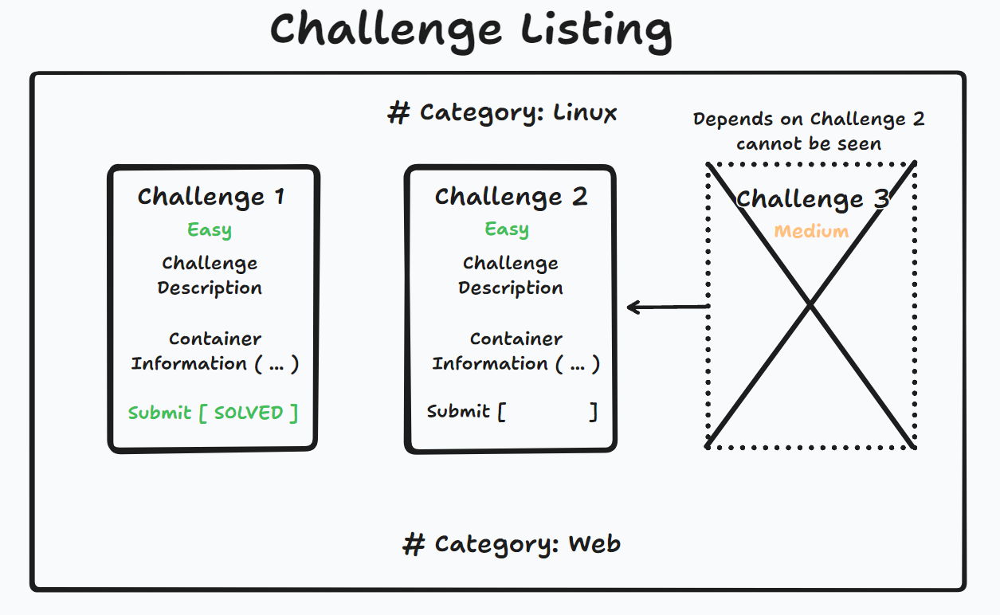
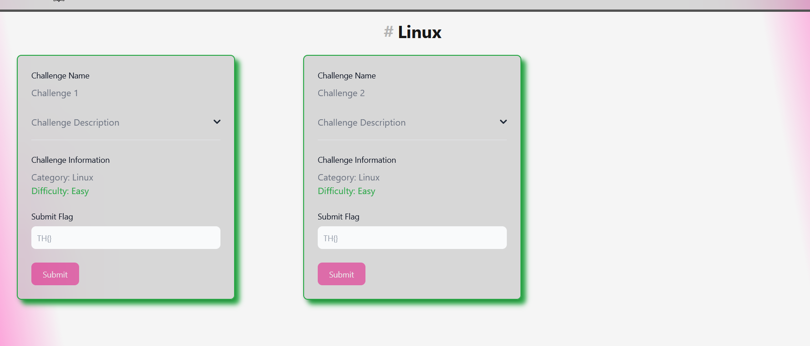

## Challenge in Generall
The overall challenge view plays a big part in the end users' satisfaction. Challenges here are presented to the user, allowing participants to access the corresponding files or necessary containers. However, challenges listed are bound to depend on others, meaning participants are not able to challenge higher difficulty challenges immediately without solving previous ones. This was made to make players start from the bottom and hinder them from going to the hard challenges immediately. This is a **recommended** feature but nevertheless is completely **optional** for event creators, since there is no reason to enforce this for all challenges.



## Challenge Overview
Once the user visits the challenge listing page, they will immediately be greeted by the challenges assigned to the event, in case there are any challenges. The challenges are displayed in a simple, sequential manner, while also being collapsible for further information. The information listed inside these challenges will be structured like this:
```
Challenge Name
├── Challenge description
├── Challenge Information
| └── Category
| └── Difficutly
├── Challenge File (optional) 
├── Challenge Container (optional) 
└── Submit Flag
```
Following that the challenge listing looks something like this:




## Purchasing Hints
Currently, hints are not purchasable or viewable inside the challenge listing. However, these hints are aimed at encouraging challengers to continue with the challenges. They will not include exact solutions, but rather approaches to deal with the problem at hand. The cost per hint on each challenge will incrementally rise if players find themselves in need of more than one, adding a dynamic element to the challenge progression.

## Challenge Approach and Solving
To facilitate active participation, users must have a functional environment. To achieve this, users can simply click on the "Start Container" button, initiating the Docker setup process. Following this action, the system promptly provides the user with the IP address and port details, ensuring a seamless and efficient start to their engagement within the designated environment.

Upon successfully solving a challenge, a player can enter the solution into the solve field and subsequently click the submit button. To maintain fair competition, challenges can only be submitted once, preventing teams from accumulating points excessively. Additionally, if a player inadvertently submits a flag that corresponds to another team's correct answer, the system will promptly issue appropriate warnings to rectify any potential discrepancies.

## How are the challenges listed
The challenge listing leverages Svelte's `each` functionality. This powerful feature enables developers to efficiently iterate through every category and challenge, dynamically displaying their respective settings and difficulty levels. By incorporating the `dependOn` attribute within the challenge table, the implementation of challenges meant to unlock after others are completed can be made straightforward.

The overall challenge listing approach used is showcased below:

```
    {:else if challenges.length > 0}
        {#each Object.entries(categories) as [key, value]}
            <h1 class="text-3xl text-center font-bold my-4 dark:text-neutral-100 text-neutral-900">
                <span class="italic text-neutral-500 opacity-50">#</span>
                {key}
            </h1>
            {#each value as challenge}
                <Card class="flex-1 max-w-[32%] min-w-[32%]">
                    <div class="mb-2">
                        <Label for="challenge-name" class="mb-2">Challenge Name</Label>
                        <p id="challenge-name">{challenge.challenge_name}</p>
                    </div>
                    <Accordion flush>
                        <AccordionItem>
                            <span slot="header">Challenge Description</span>
                            <p class="mb-2 text-gray-500 dark:text-gray-400">{challenge.challenge_description}</p>
                        </AccordionItem>
                    </Accordion>
                ...
        ...
    ...
```
Here, we check if the **challenges** variable, which holds the challenges, is greater than zero. This is done to determine if there are any challenges to list. Without this check, the page would result in errors when attempting to access challenges that do not exist. After that, we iterate through the categories obtained from the challenge entries. While iterating through these categories, we also loop through the challenges that match the category. Meanwhile, the corresponding information for these challenges is retrieved and listed on the page.

___

Authors: Malik F. & Maximilian B.