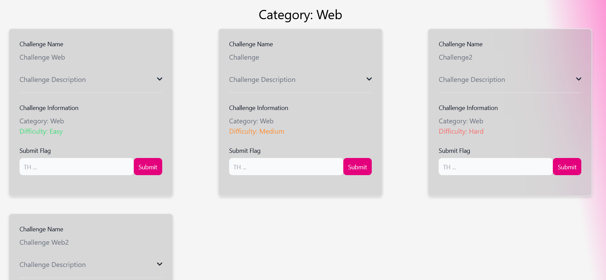

## Challenge Overview
In our CTF Challenge View, challenges are presented without restrictions, allowing participants to access them independently, without the need to solve others first. This approach enables players to challenge themselves with more difficult tasks right from the start. The challenges are displayed in a sequential manner, and each one can be collapsed to conserve space. Upon clicking a challenge, detailed information, including the Challenge Description, Solve Field, Buy Hints, and Start Container, is revealed for easy navigation and engagement.

## Purchasing Hints
We aim to foster the curiosity of our players and encourage them to seek hints when necessary. These hints, however, are designed not to divulge the solution outright but rather provide a helpful tool or guidance. The cost per hint will incrementally rise if players find themselves in need of more than one, adding a dynamic element to the challenge progression.

## Challenge Setup
To facilitate active participation, users must have a functional environment. To achieve this, users can simply click on the "Start Container" button, initiating the Docker setup process. Following this action, the system promptly provides the user with the IP address and port details, ensuring a seamless and efficient start to their engagement within the designated environment.

## Challenge Solving
Upon successfully solving a challenge, a player can enter the solution into the Solve Field and subsequently click the Submit button. To maintain fair competition, challenges can only be submitted once, preventing teams from accumulating points excessively. Additionally, if a player inadvertently submits a flag that corresponds to another team's correct answer, the system will promptly issue appropriate warnings to rectify any potential discrepancies.

## Challenge Listing
The Challenge listing leverages Svelte's each functionality. This powerful feature enables developers to efficiently iterate through every category and challenge, dynamically displaying their respective settings and difficulty levels. The approch that was used is listed below:

```
    {:else if challenges.length > 0}
        {#each sortedData as category}
            <h1 class="text-3xl text-center mt-8">Category: {category[0].challenge_category}</h1>
            <div class="grid grid-cols-1 lg:grid-cols-3 gap-4 lg:gap-2 place-items-center">
            
            {#each category as challenge}
                <Card class="flex-1 max-w-[32%] min-w-[32%]">
                    <div class="mb-2">
                        <Label for="challenge-name" class="mb-2">Challenge Name</Label>
                        <p id="challenge-name">{challenge.challenge_name}</p>
                    </div>
                    <Accordion flush>
                        <AccordionItem>
                            <span slot="header">Challenge Description</span>
                            <p class="mb-2 text-gray-500 dark:text-gray-400">{challenge.challenge_description}</p>
                        </AccordionItem>
                    </Accordion>
                ...
        ...
    ...
```

This results in the challenges being listed below the category name, whilst being sorted by difficulty:



___

Authors: Malik F. & Maximilian B.