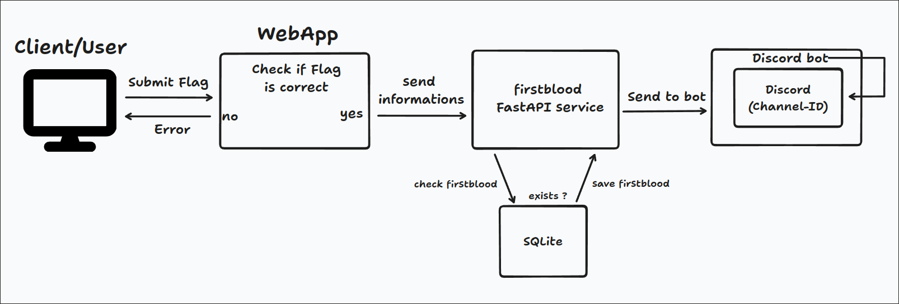

Having a Firstblood system is more of an optional goal, but still one worth aiming for. Deploying it allows players to race against each other and showcase their skills to others. In our Firstblood system, we deploy one docker container with 2 processes inside it. The processes consist of the **FastAPI** which accesses a simple **SQLite** database, and the other being the **discord-bot**, responsible for the request which are sent into the server for everyone to see. This involves sending challenge solves to the **FastAPI**, which then verifies if an entry for that challenge exists within the corresponding event. If not, the **discord-bot** fetches the solves and displays it into the chat.


The graph, which is shown above, showcases the overall workflow from the **webapp** to the **Firstblood** container. After the **webapp** verifies that the flag sent by the user is valid, that "challenge submit" is sent to the **FastAPI**, where it is if the entry for that exact challenge and event is already existing or not. The **discord-bot**, on the other hand, periodically fetches newly created firstblood entries and presents them inside a discord-channel.

## How we deploy it:
The container allows for a simple deployment with an volume, to store data allready sent to the **FastAPI**. The container also allows to simple remove the **discord-bot** since it isnt necessarly needed, in this case however it will be further used. To fully deploy the container, three environment variables are needed, which are:
- `BLOODTOKEN` -> This is the authentication token which is used for the firstblood service, so that no unauthenticated user has access to the database.
- `DISCORD_TOKEN` -> The discord-token itself represents the bot which is needed to run the service on an **discord-bot**. For further information on creating an discord bot, check out this site: [Discord Developers](https://discord.com/developers/applications) 
- `DISCORD_CHANNEL_ID` -> The Discord channel ID functions as a key indicator for the bot, specifying where to direct its messages. This is crucial for controlling access to and managing the bot. Allowing users to write in the same channel where the bot presents the Firstblood defeats the purpose of its uniqueness, and therfore needs to be controlled.

## Implementation
The Firstblood system implements **FastAPI** to capture every solve submitted to the **webapp**, checking its validity.<br/>
The `/firstbloods/add` endpoint should receive the solves from the **webapp**. The information provided through this endpoint is then checked and if there was no similar entry found, it will be saved as such. The endpoint looks something like this:

```py
@app.post("/firstbloods/add/", dependencies=[Depends(authorize)], tags=["FirstBloods"])
def create_firstblood(
    firstblood: schema.FirstBloodCreate, db: Session = Depends(get_db)
):
    """
    Create a new FirstBlood entry.
    - If date is not provided, current time is selected.
    - Date can be provided in two ways:
        - As a datetime object. (str)
        - As a Unix timestamp. (int)
    """
    if firstblood.date is None:
        firstblood.date = datetime.now(pytz.timezone("Europe/Vienna")).replace(
            microsecond=0
        )
    elif isinstance(firstblood.date, int):
        firstblood.date = datetime.fromtimestamp(firstblood.date)
    else:
        firstblood.date = firstblood.date.replace(microsecond=0)
    db_firstblood = models.FirstBlood(**dict(firstblood))
    db.add(db_firstblood)
    try:
        db.commit()
    except IntegrityError:
        db.rollback()
        raise HTTPException(
            status_code=400,
            detail="A record with the same event_id and challenge_id already exists.",
        )
    db.refresh(db_firstblood)
    return db_firstblood
```

<br/>The `/firstbloods/all` is for receiving all the firstbloods from the db. There is also an endpoint called `/firstbloods/filter`, however it was mainly used for troubleshooting and checking. These endpoints are rather similar, just differentiating in the variables used for the calls.
Nonetheless, both these endpoints use the variable **was_update_sent**, which marks the firstblood as sent after every fetch from the bot. This variable was used in case of the **discord-bot** crashing, so that it could continue where it left of. The `/firstbloods/all` endpoint looks something like this:

```py
@app.get("/firstbloods/all/", dependencies=[Depends(authorize)], tags=["FirstBloods"])
def read_all_firstbloods(
    update_was_sent: Optional[bool] = Query(
        False, description="Updates the was_sent value for entries"
    ),
    db: Session = Depends(get_db),
):
    """
    Get all firstbloods in the database.
    """
    firstbloods = db.query(models.FirstBlood).all()
    if update_was_sent:
        entries_to_send = []
        for firstblood in firstbloods:
            if not firstblood.was_sent:
                data = {
                    "event_id": firstblood.event_id,
                    "challenge_id": firstblood.challenge_id,
                    "date": firstblood.date,
                    "username": firstblood.username,
                    "challenge_name": firstblood.challenge_name,
                    "challenge_category": firstblood.challenge_category,
                    "challenge_difficulty": firstblood.challenge_difficulty,
                }
                entries_to_send.append(data)
                firstblood.was_sent = True

        # Write the new entries to the sent_firstbloods table
        db.commit()
        return entries_to_send
    return firstbloods
```

<br/>The model in which those solves are solved is showcased in the graph below:
```py
class FirstBlood(Base):
    __tablename__ = "events"
    id = Column(Integer, primary_key=True, index=True)
    date = Column(DateTime, nullable=False)
    username = Column(String, nullable=False)
    event_id = Column(String, nullable=False)
    challenge_id = Column(String, nullable=False)
    challenge_name = Column(String, nullable=False)
    challenge_category = Column(String, nullable=True)
    challenge_difficulty = Column(String, nullable=True)
    was_sent = Column(Boolean, default=False)
    __table_args__ = (
        UniqueConstraint("event_id", "challenge_id", name="_event_challenge_uc"),
    )

```

<br/>The other piece of the Firstblood system uses a **discord-bot** to send solves into the corresponding discord channel. For it to easily work, we used the **discord.py** python library for creating bots. The library provides important features for functionalities and more. Especially important are the **intents**, which let you choose what your bot gets from Discord servers, cutting down on unnecessary stuff and making it work better. You set these intents when you create your commands.Bot() instance, controlling what your bot can access. It's all about making your bot use fewer resources and respond faster. The overall setup that was used for the bot looks something like this:

```py
# Create the bot and set permissions and intents
intents = discord.Intents.default()
intents.message_content = True
bot = commands.Bot(command_prefix="$", intents=intents)
logging.basicConfig(level=logging.INFO)
channel = None
usedblood = []
```

After the bot successfully starts, it initiates a background task which repeats itself every 10 seconds. Inside this task, solves are fetched, and the corresponding embedded messages are created for the channel. The reason for using embedded messages is to make them look better for the participants. The way the bot posts these messages looks something like this:

```py
@tasks.loop(seconds=10)
async def my_background_task():
    """
    This is the background task which will be executed every 10 seconds.

    It will check for new FirstBloods and send a message to the channel if there are any.
    """
    data = get_all_firstblood()
    if data is not None:
        global usedblood
        if data != []:
            for item in data:
                if item not in usedblood:
                    embed = Embed(
                        title=f"Challenge: {item['challenge_name']}", color=0xFF0000
                    )
                    embed.set_author(name="CHALLENGE SOLVED (FIRST BLOOD)")
                    embed.description = f"- Solved by: **@{item['username']}**\n- Time solved: **{item['date'].split('T')[1]}**\n- Category: {item['challenge_category']}\n- Difficulty: {item['challenge_difficulty']}\n\n Good job!"
                    embed.set_thumbnail(
                        url="IMAGEURL"
                    )
                    new_msg = await channel.send(embed=embed)
                    await new_msg.add_reaction("🩸")
                    usedblood.append(item)
    else:
        logging.error("The request failed")
```

And the function `get_all_firstblood()`, from where it receives the data, looks something like this:
```py
def get_all_firstblood():
    """
    This function will make a request to the FastAPI server to get all FirstBloods.

    If the request is successful, it will return the data. Otherwise, it will return None.
    """
    url = "http://webdc:80/firstbloods/all/?update_was_sent=true"
    headers = {"Authorization": f"Bearer {os.getenv('BLOODTOKEN')}"}
    response = requests.get(url, headers=headers)
    if response.status_code == 200:
        return response.json()
    else:
        return None
```

The `//webdc:80/` here represents the **FastAPI** which was mentioned earlier, and the `/?update_was_sent=true` sets the solves which were already fetched as true, so that they won't be refetched again.


___

Authors: Malik F.