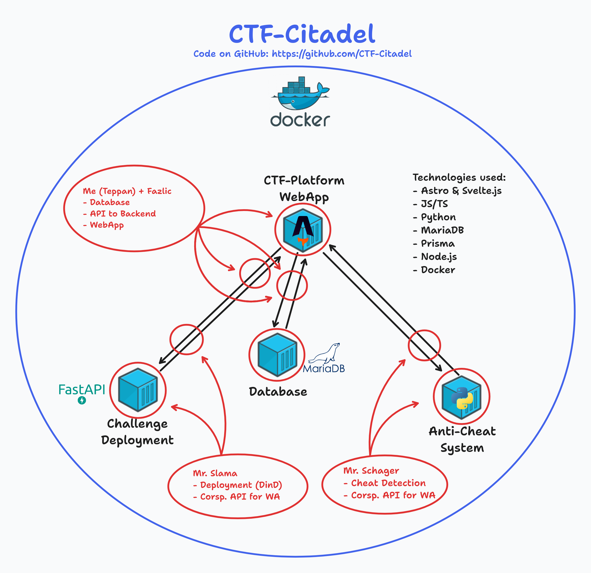

This shows the currently deployed infrastructure of the CTF-Citadale stack

The Infra-Middleware is used to control the entire lifecycle of the challenge container instances.

It's a Docker container utilizing Docker in Docker for easy separation.
We use FastAPI to create a RESTful interface.

# General workflow & features

## Challenge fetch
Once the Infra-Middleware container is started, we check for challenges.
This is done by downloading the challenge GitHub repository. The challenges can also be provided as a downloadable ZIP.
### Challenge schema
Each challenge has the following structure

After the challenges are downloaded, they can be deployed using the corresponding REST endpoint.

## Challenge creation
Because most of our challenges use multiple containers for one challenge instance, we use Docker-Compose.
When a user starts a challenge, the webapp backend calls the middleware with Flag and Challenge type as a parameter.

In the middleware, each instance gets assigned a UUID. This UUID will be used to identify the instance hereafter.
For every instance, the challenge folder is copied to a folder named after the UUID.
In this folder we will find:
- compose-file
- mount for container files

Once the files are copied, we start the container build process using the parameters given by the webapp backend as environment variables.
After the finished build the middleware returns the UUID, the challenge and the environment variables.
These values are then used by the webapp.

## Instance health check
To make sure that each team can only deploy one instance of each challenge, we have a health-check endpoint.
This endpoint takes the instance-id sent to the webapp after a new instance and gets the corresponding docker-internal IDs.
Using the internal IDs, the status of each container in the instance deployment is checked and saved to an array.

If the array is empty or contains something other than "running", the deployment is unhealthy.
In this case, a team can deploy a new instance of this challenge.

If all containers in said array are running, the deployment is healthy, therefore the team won't be able to deploy another instance of the challenge.

## Local volume mount.
As described in "Challenge creation" the volumes of the deployment can be accessed via the CLI or a graphical browser.
This allows admins to easily modify flags, make fixes or make adjustments.

This would most likely conflict with a distributed (multi-node) deployment of the infra-middleware.
In that scenario, multiple connections to the instances have to be opened to access the files.

Two possible fixes/solutions to this:
- Mount to network share (might cause a lot of io-wait)
- An API will return the location of volume with a central dashboard

# Scaling the infrastructure backend

## The issue
In the current version (as of 18.1.2024), the challenge deployment lacks any horizontal scalability. This is because of the way docker is intended to be used.

## The solution
To get around the restrictions of a single node docker deployment, we have three options:
1. Have the middleware connect to multiple docker-sockets on multiple machines
2. Rewriting the entire middleware for Kubernetes
3. Using Docker Swarm to distribute the workload

Nr. 1 is an unrealistic amount of work and anything but best practice.
Nr. 2 is certainly intriguing, but Kubernetes for a project of this size (Single day event) could be considered overkill.
Nr. 3, moving to Docker Swarm. This would allow for easier scaling and more flexibility, without the hassle of rebuilding the entire thing for Kubernetes but comes with a lot of limitations.

After a lot of comparing and consideration we chose to use Kubernetes, more specifically [OKD](https://www.okd.io/)

# OKD - k8s distribution that powers Red Hat OpenShift
OKD is a free, open-source distribution of Kubernetes that powers Red Hat OpenShift. It offers robust container orchestration, automated deployments, scalability, and extensive security features. Its open-source nature, compatibility with Kubernetes, and rich feature set make it a popular choice for managing containerized applications.

## The cluster design
We will use 6 blades in our schools blade center. Three blades will assume the master/controller role (while also working), and the other blades will be worker nodes.
With this setup we will have a total of
- 136 Hyperthreading CPU Cores
- 754 GB of DDR4 Memory

this should be sufficient for our little event.

The communication to the outside world will be handled by an ingress controller. OKD has a built-in one as a part of OpenShift Router.

_Simplified_

The ingress controller will be exposed to the internet. The decision was made to avoid SSL/TLS issues.
We will use LetsEncrypt to obtain trusted SSL certificates. This way, we can avoid certificate trust issues. (not everyone will use a AD-joined school machine)
The cluster health will be monitored using the in-built OKD Dashboard.

### Migrating the challenges
As specified above, each deployable challenge contains a docker-compose file. These files will be changed to deployment.yml's
Additionally, in each deployment.yml the routing must be defined. This will be addressed in the next sprint.

### Migrating the infra-middleware service
Currently, the infra-middleware interacts with a local Docker socket using the python Docker module.
The affected functions will have to be rewritten. Most likely we will use the [Python Kubernetes Client](https://github.com/kubernetes-client/python) module.
Also the instance subfolders won't be directly compatible. A possible fix could be a shared distributed volume. This will also be worked on in the next sprint.

### Routing to the instances
The goal is, that every single deployment is accessible via the Inter- or Intranet. To achieve this, we plan to use subdomains.
For example: r4nd0mh3x.cluster.tophack.at

This will be achieved using the OpenShift Router and a wildcard SSL Certificate for our domain *.cluster.tophack.at

___

Authors: Felix S.
