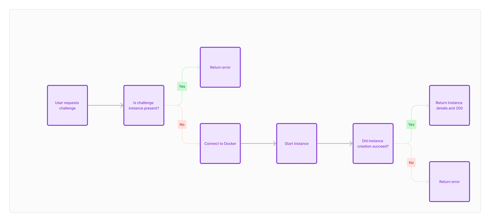

//TODO: Bigpicture, flowchart
The Infra-Middleware is used to control the entire lifecycle of the challenge container instances.

It's a Docker container utilizing Docker in Docker for easy seperation.
We use FastAPI to create a RESTful interface.

## Challenge fetch
Once the Infra-Middleware container is started, we check for challenges.
This is done by downloading the challenge GitHub repo. The challenges can also be provided as a downloadable ZIP.

After the challenges are downloaded, they can be deployed using the corrosponding REST endpoint.

## Challenge creation
Because most of our challenges use multiple containers for one challenge instance, we use Docker-Compose.
When a user starts a challenge, the webapp backend calls the middleware with Flag and Challange type as a parameter.

In the middleware, each instance gets assigned a UUID. This UUID will be used to identify the instance hereafter.
For every instance, the challenge folder is copied to a folder named after the UUID.
In this folder we will find:
- compose-file
- mount for container files

Once the files are copied, we start the container build process using the parameters given by the webapp backend as environment variables.
After the finished build the middleware returns the UUID, the challenge and the environment variables.
These values are then used by the webapp.

## Instance health check
To make sure that each team can only deploy one instance of each challenge, we have a health-check endpoint.
This endpoint takes the instance-id sent to the webapp after a new instance and gets the corrosponding docker-internal IDs.
Using the internal IDs, the status of each container in the instance deployment is checked and saved to an array.

If the array is empty or contains something other than "running", the deployment is unhealthy.
In this case, a team can deploy a now instance of this challenge.

If all containers in said array are running, the deployment is healthy, therefore the team won't be able to deploy another instance of the challenge.

## Local volume mount.
As described in "Challenge creation" the volumes of the deployment can be accessed voa the CLI or a graphical browser.
This allows admins to easily modify flags, make fixes or make adjustments. 

This would most likely conflict with a distributed (multi-node) deployment of the infra-middleware.
In that scenario, multiple connectiosn to the instances have to be opened to access the files.

Two possible fixes/solutions to this:
- Mount to network share (might cause a lot of io-wait)
- A API will return the location of volume with a central dashboard

___

Authors: Felix S.