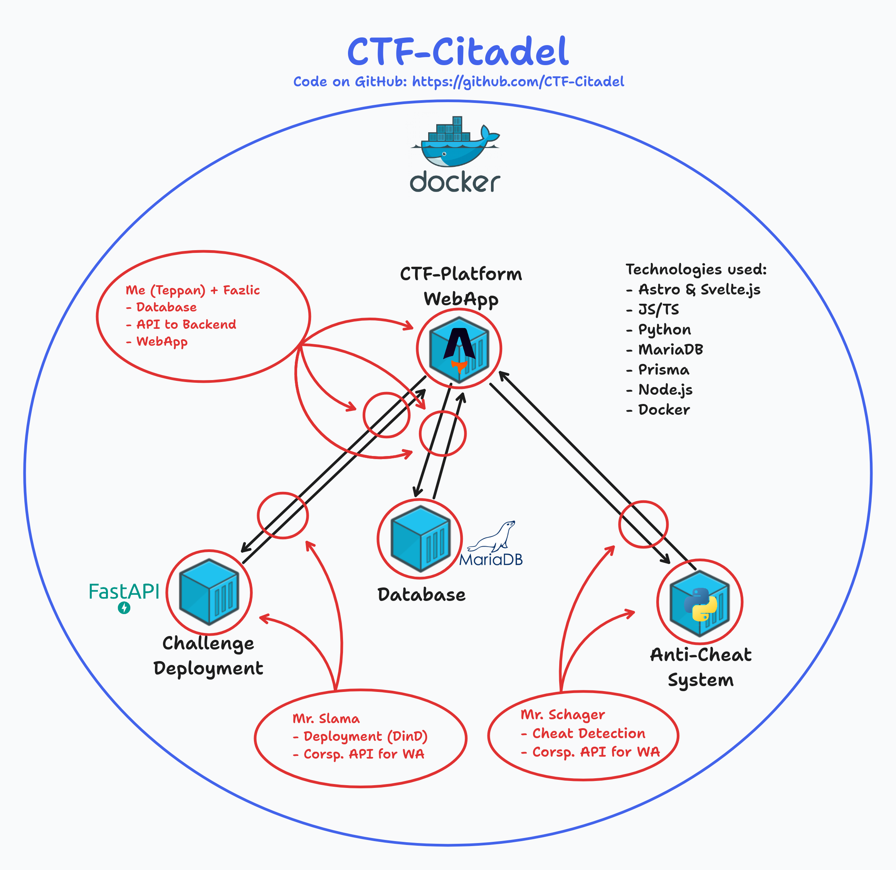
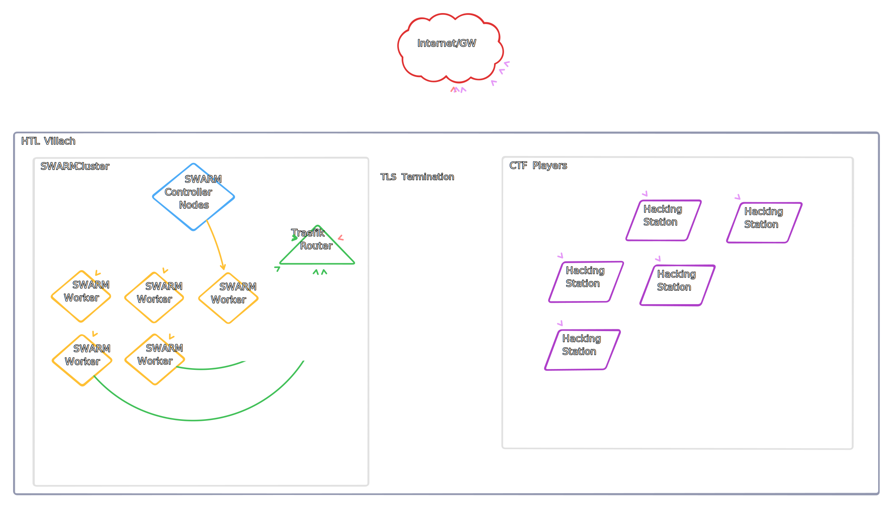

This shows the currently deployed infrastructure of the CTF-Citadale stack


The Infra-Middleware is used to control the entire lifecycle of the challenge container instances.

It's a Docker container utilizing Docker in Docker for easy separation.
We use FastAPI to create a RESTful interface.


# General workflow & features

## Challenge fetch
Once the Infra-Middleware container is started, we check for challenges.
This is done by downloading the challenge GitHub repository. The challenges can also be provided as a downloadable ZIP.
### Challenge schema
Each challenge has the following structure

After the challenges are downloaded, they can be deployed using the corresponding REST endpoint.

## Challenge creation
Because most of our challenges use multiple containers for one challenge instance, we use Docker-Compose.
When a user starts a challenge, the webapp backend calls the middleware with Flag and Challenge type as a parameter.

In the middleware, each instance gets assigned a UUID. This UUID will be used to identify the instance hereafter.
For every instance, the challenge folder is copied to a folder named after the UUID.
In this folder we will find:
- compose-file
- mount for container files

Once the files are copied, we start the container build process using the parameters given by the webapp backend as environment variables.
After the finished build the middleware returns the UUID, the challenge and the environment variables.
These values are then used by the webapp.


## Docker Sock bind mount
By using a bind mount, the `docker.sock` of the host machine can be used in a container.
A small change in the `/etc/docker/daemon.json` file allows for multiple push & pulls of images at the same time, allowing for multiple containers to be built at the same time.

```bash
{
    "max-concurrent-uploads": 1000,
    "max-concurrent-downloads": 1000
}
```

# Scaling the infrastructure backend

To get around the restrictions of a single node docker deployment, we have three options:
1. Have the middleware connect to multiple docker-sockets on multiple machines
2. Rewriting the entire middleware for Kubernetes
3. Using Docker Swarm to distribute the workload

Nr. 1 is an unrealistic amount of work and anything but best practice.
Nr. 2 is certainly intriguing, but Kubernetes for a project of this size (Single day event) could be considered overkill.
Nr. 3, moving to Docker Swarm. This would allow for easier scaling and more flexibility, without the hassle of rebuilding the entire thing for Kubernetes but comes with limitations.

Finally the decision was made to go with Docker Swarm to ensure a easy challenge design and infrastructure deployment. 

# Docker Swarm
Docker Swarm is the multi-node orchestrated version of the well known Docker. It allows for distributed workloads and scalable architectures.

## The cluster design
For TopHack2024 we rented multiple machines in the Hetzner Cloud. 
The communication to the outside world will be handled by an ingress controller. In this case Traefik


_Simplified_

The ingress controller will be exposed to the internet. The decision was made to avoid SSL/TLS issues.
We use LetsEncrypt to obtain trusted SSL certificates. This way, we can avoid certificate trust issues. (not everyone will use a AD-joined school machine)
The cluster health will be monitored using Portainer.

### Specifying a challenge
As specified above, each deployable challenge contains a docker-compose file. These files need to contain the routing information labels section.

```yml
services:
  flask:
    image: dockerhubusername/${INSTANCE_ID}
    build:
      context: .
      dockerfile: Dockerfile
      args:
        - FLAG=$FLAG
    networks:
      - traefik-public
    deploy:
      replicas: 1
      labels:
        - "traefik.enable=true"
        - "traefik.http.routers.${INSTANCE_ID}.rule=Host(`${INSTANCE_ID}.cluster.tophack.org`)"
        - "traefik.http.routers.${INSTANCE_ID}.entrypoints=http"
        - "traefik.http.services.${INSTANCE_ID}.loadbalancer.server.port=5000"
networks:
  traefik-public:
    external: true
```

### Interacting with the Docker Sock
The middleware uses a series of subprocesses to build, push and then deploy the challenges to Docker Swarm.


### Routing to the instances
The goal is, that every single deployment is accessible via the Inter- or Intranet. To achieve this, we use subdomains.
For example: r4nd0mh3x.cluster.tophack.at

This will be achieved using the Traefik ingress controller and a wildcard SSL Certificate for our domain *.cluster.tophack.at/org

___

Authors: Felix S.
