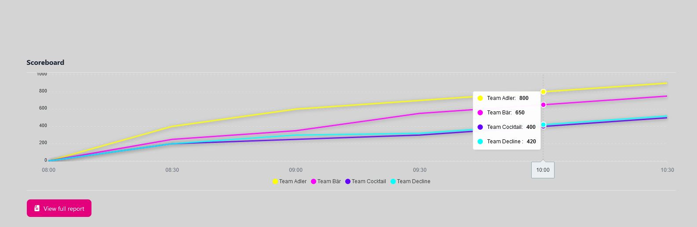

Scores in our CTF represent user achievements or performance by completing our challenges. By finding flags and submitting them, users can earn points for their entire team. Points collected by one team member cannot be collected at the same challenge again. 

## Scoreboard ##

In the Scoreboard the users will be able to see their teams and other teams performance. We do that by using an UI-Component which is basically a Chart which will show Team Points in a Line Diagram. 

## Leaderboard ##

In the Leaderboard we will see the same as in the Scoreboard with the Slight Difference of there being no UI-Component representing it for you in a fancy way. This will simple consinst of a Table Listing. 

For further description
...

___

Authors: Malik F.