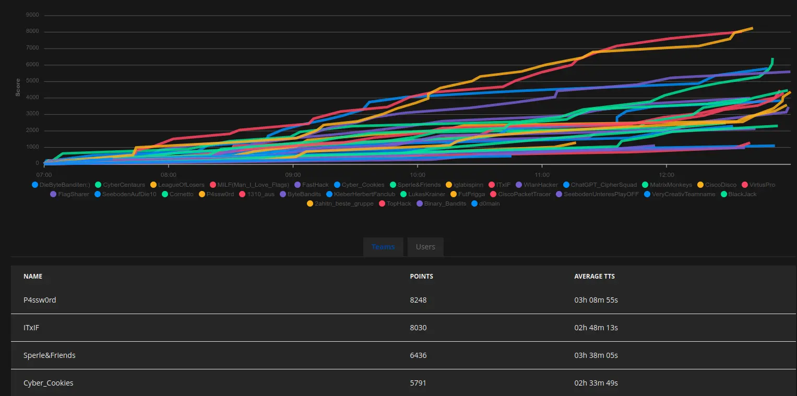

Scores in our CTF represent user achievements or performance by completing our challenges. By finding flags and submitting them, users can earn points for their entire team. In general, points are awarded to teams, which attribute their solves to their respective solving users. This means that points are generally boun to teams and can therefor only be solved once pear team, but also bound to the user that solved them.

This gives the platform the ability to show cumulative scores for teams, as well as also being able to show user scores separately.



## Scoring System

CTF-Citadel uses a standard Dynamic Scoring implementation, which in simple terms means that if a challenge is solved by more people over time, the challenge worth (measured in points) decreases for all team. The implementation used works by utilizing a simple formular, listed below.

```text
floor(max(p / 10, Number(p * min(1, k / (k + x - 1)) ** 1.2)));
```

The `x` refers to the number of solves and the `p` to the base points of the corresponding challenge. The impact of point degradation is controlled by the `k` factor, which can be defined by the hosters when initially setting up the platform.

---

Authors: Fabian T.
