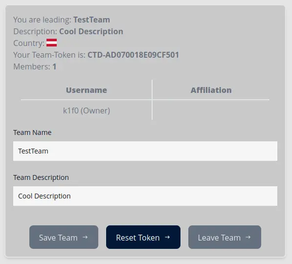
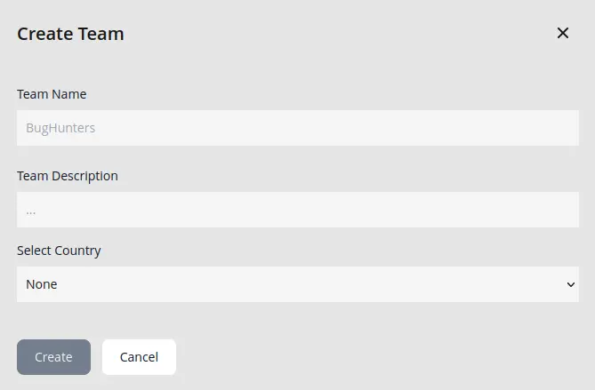
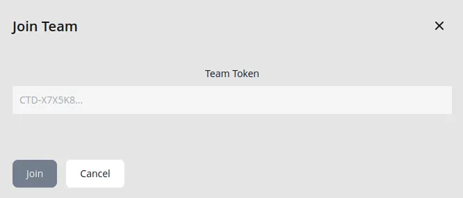

Once a user has created an account, he has the ability to either create a new team on his own, or join an exisitng team via a token that is generated when the team is first created.

## Handling Leaves and Team Owners

In general, users are free to create, join and leave teams if they are not yet assigned to any running event. Until they are, users who are not the team creator themselves can leave a team based on their own will.

When a team is assigned and competing in an ongoing event, team members and leaves are locked and users are unable to leave the team until the event is completed and finished.

Team Creators are special in the way that they can only leave an existing team if all other users have left before them. When a Team Creator is the last one to leave a team, that team gets deleted automatically.

## Creating a Team

Each user has the ability to create his own team once he has successfully registered on the platfrom.

Each user is only allowed to have a single team at any point in time. A user can also not be member of multiple teams a the same time.

## Joining a Team

Joining is handled via the Team's Token, which can be handed freely to anyone that wants to join an existing team.

If the token is valid, the user should get assigned to the corresponding team automatically, if all conditions for it are met.

---

Authors: Fabian T.
