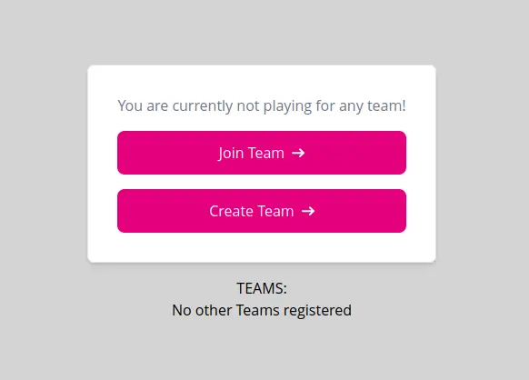
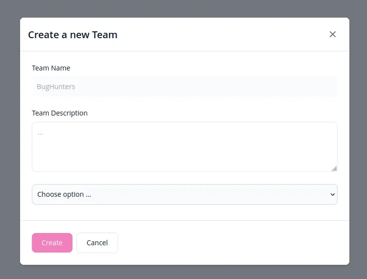
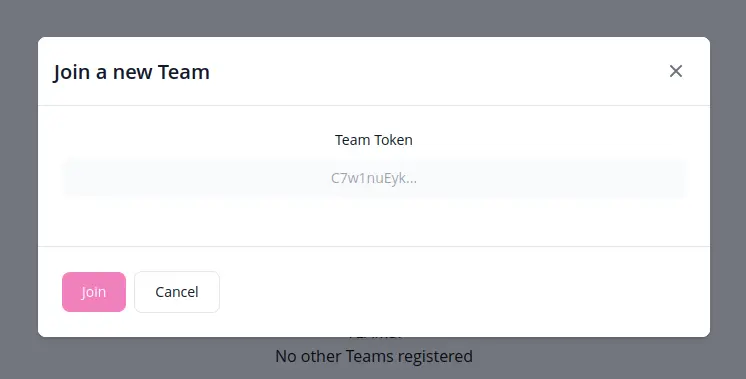

Once a user has created an account, he has the ability to either create a new team on his own, or join an exisitng team via a token that is generated when the team is first created.

## Creating a Team

Each user has the ability to create his own team once he has successfully registered on the platfrom.

:::note
Each user is only allowed to have a single team at any point in time.

A user can also not be member of multiple teams a the same time.
:::

## Joining an exisitng Team

Joining is handled via the Team's Token, which can be handed freely to anyone that wants to join an existing team.

:::tip
A team Token can always be regenerated in case it got into the wrong hands!
:::

---

Authors: Fabian T.
