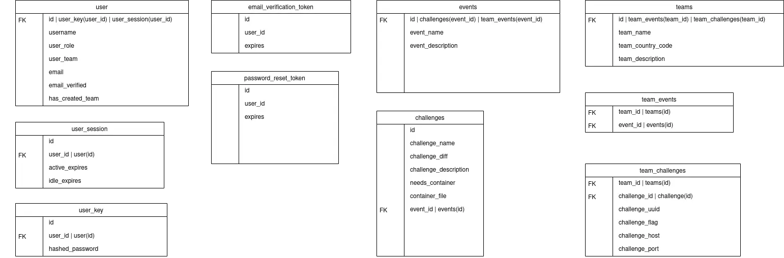
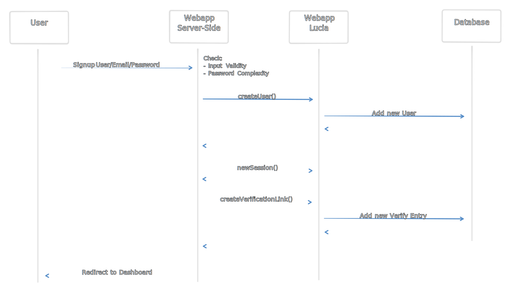
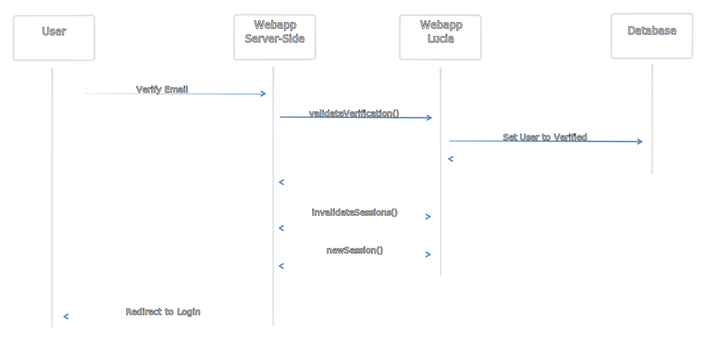
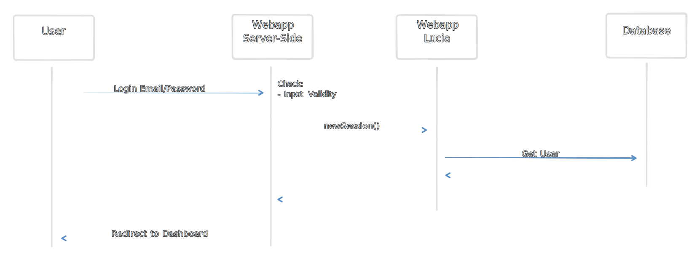
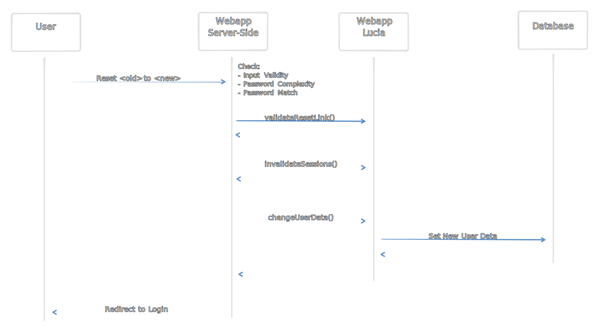
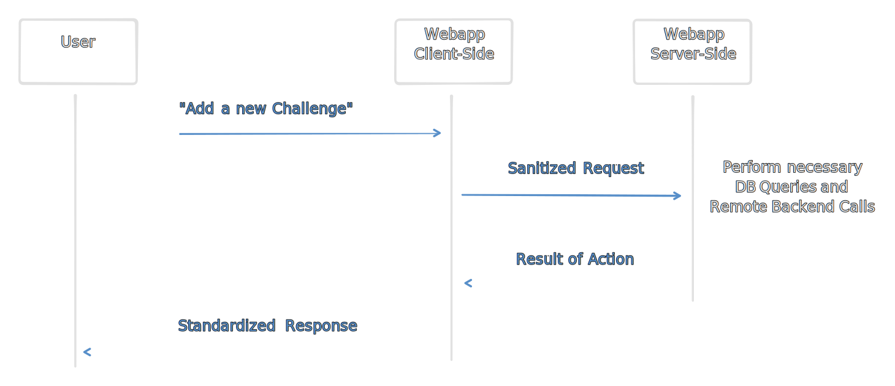

This is a complete introduction into how CTF-Citadel works under the hood.

## Motivation ##

We decided to built a new platform because we weren't satisfied with what current solutions available provided out of the box. Although some other projects provide things like plugin systems, those never worked out in a way we would've liked them to, so we decided to take the matters into our own hands and start from zero.

## Frameworks and Languages ##

We settled on modern technologies and frameworks to build CTF-Citadel from the ground up including:

- [Astro.js](https://astro.build/): A modern JavaScript Meta-Framework that enables rapid developement and cutting edge features.
- [Svelte.js](https://svelte.dev/): the *better React* as we like to call it, compiles to vanilla JavaScript and is extremely efficient, compact and fast.
- [TailwindCSS](https://tailwindcss.com/): CSS done right.
- [Lucia Auth](https://lucia-auth.com/): a simple and clean Authentication System that is written completely in TypeScript and works wondefully alongside Frameworks like Astro and Svelte.

## Database Integration ##

We use MariaDB as our primary and only database to store userdata from Lucia, as well as Event and Challenge Data.

To make our database queries easier and safer, we chose to go with [Prisma](https://www.prisma.io/), which integrates with Lucia [like this](https://lucia-auth.com/database-adapters/prisma/).

Our current database schema looks like this:



> **Note**: This Schema is still a work in progress and will be updated as we add all the necessary features.

## Login and Authentication

Most of the functionality is handled directly by Lucia Auth and therefore also documented on [their page](https://lucia-auth.com/getting-started/).

We used the basic example for Astro that is [provided here](https://github.com/lucia-auth/examples/tree/main/astro/email-and-password) and modified it to our needs.

All related logic to Lucia can be found under:

- `src/lib/lucia.ts`: Base Initializations for making Lucia work
- `src/lib/lucia-db.ts`: All additional interactions with the database that relate to Lucia in terms of password reset and email verification
- `src/pages/login.astro`: Main Login page for logging in users and creating a new session
- `src/pages/signup.astro`: Main Signup Page for creation of new users
- `src/pages/reset/*.astro`: The subpages and logic required to make password resets work
- `src/pages/verify/*.astro`: The subpages and logic for validating email verification links

Additionally we use the middleware integration that is documented [](https://lucia-auth.com/basics/handle-requests/#astro) which can be found in `src/middleware.ts`

> **Note**: As we adapt to newer versions of Astro which handles middleware differently, this could need adaption both on our side and Lucia upstream.

### Signup Flow ###

The Signup Process is realtively straight forward and consists of creating a new user with Lucia and generating a new Email Verification Link.



Until the User has verified their E-Mail, the Dashhboard will not allow the User to interact with the WebApp

```ts
// ...
session = await Astro.locals.auth.validate();
if (!session) return Astro.redirect('/login');
if (!session.user.emailVerified) {
    return Astro.redirect('/verify/email');
}
// ...
```

### Email Verification ###

When the user clicks on the Email Verification Link that is sent to his E-Mail, the following happens:



Now the user is verified and can re-login to the Platform.

### Login Flow ###

Provided that our User now has successfully verified their email:



Should the user still not have verified their Email, he will have to go through the Verification Process above.

### Password Reset ###

The WebApp also provides the ability to reset a Users password via a Link that is sent per E-Mail in advance:



After re-login, the user should be able to interact with the Platform again. A Email-Reverification is not required.

## Handling Client Requests ##

We perform all of the interactions with the database and the Remote Challenge Backend on the Server-Side. This is to ensure that we can validate all requests for their correct format and permission scope.

How this works can be seen here:



By making requests from the backend we can also redact things like API-Tokens and other stuff that we may want to add as additional context for the Remote Backend or Database.

To stay consistent for requests that dont concern Lucia, there is a wrapper function in place:

```ts
export type WrapperFormat = {
    type: string;
    data?: any | undefined;
};

export async function requestWrapper(dest: string, request: WrapperFormat): Promise<Response> {
    return await fetch(dest, {
        method: 'POST',
        body: JSON.stringify(request)
    });
}
```

All communication to the server side should be handled through this and the permission scope checked accordingly in the corresponding `*.astro` files.

The subpages also perform requests through two different wrappers:

```ts
export async function normalWrapper(request: Request): Promise<Response> {
    let json: WrapperFormat;
    try {
        json = (await request.json()) as WrapperFormat;
    } catch {
        return new Response(
            JSON.stringify({
                data: [],
                error: true
            })
        );
    }

    // match the request tyoe
    switch (json.type) {
        // handle action here
        // ...
    }

    // formulate unifed response
    return new Response(
        JSON.stringify({
            data: response,
            error: false
        })
    );
}
```

```ts
export async function privilegedWrapper(request: Request): Promise<Response> {
    let json: WrapperFormat;
    try {
        json = (await request.json()) as WrapperFormat;
    } catch {
        return new Response(
            JSON.stringify({
                data: [],
                error: true
            })
        );
    }

    // match the request tyoe
    switch (json.type) {
        // handle action here
        // ...
    }

    // formulate unifed response
    return new Response(
        JSON.stringify({
            data: response,
            error: false
        })
    );
}
```

These differ only in their permission scope and we aim to combine them into one unified wrapper with a privilege boolean instead. The switch statement can handle all necessary backend steps to be taken for fullfilling the user request, making sure that in the end we return a unified response to the user.

___

Authors: Birnbacher Maximilian, Fabian T.