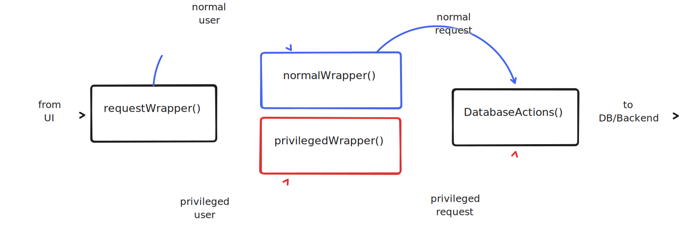

This is a complete introduction into how CTF-Citadel works under the hood.

## Motivation

We decided to built a new platform because we weren't satisfied with what current solutions available provided out of the box. Although some other projects provide things like plugin systems, those never worked out in a way we would've liked them to, so we decided to take the matters into our own hands and start from zero.

## Frameworks and Languages

We settled on modern technologies and frameworks to build CTF-Citadel from the ground up including:

-   [Astro.js](https://astro.build/): A modern JavaScript Meta-Framework that enables rapid developement and cutting edge features.
-   [Svelte.js](https://svelte.dev/): the _better React_ as we like to call it, compiles to vanilla JavaScript and is extremely efficient, compact and fast.
-   [TailwindCSS](https://tailwindcss.com/): CSS done right.
-   [Lucia Auth](https://lucia-auth.com/): a simple and clean Authentication System that is written completely in TypeScript and works wondefully alongside Frameworks like Astro and Svelte.
-   [Flowbite-Svelte](https://flowbite-svelte.com/): Simple UI Framework for Svelte Components

## Database Integration

We use MariaDB as our primary and only database to store userdata from Lucia, as well as Event and Challenge Data.

To make our database queries easier and safer, we chose to go with [Prisma](https://www.prisma.io/) in the first place, which integrates with Lucia 2.0.

:::note
Prisma was depreciated as soon as Lucia V3 was released, which included a new adapter for [Drizzle ORM](https://orm.drizzle.team/).

The decision was made to go this route because the development team was not satisifed with the performance and usage habits of Prisma so far.
:::

## Migration to Lucia 3.0 and DrizzleORM

Shortly after the release of Lucia Version 3.0, the decision was made to switch to [Drizzle ORM](https://orm.drizzle.team/) as an ORM, which integrates exceptionally well with TypeScript.

The DB-Schema itself is defined in `src/lib/schema.ts`, and consists fully of standard TypeScript decalrations that can be used out of the box, without generating a adapter like Prisma does.

```ts
// schema.ts
import { mysqlTable, varchar } from 'drizzle-orm/mysql-core';
// ...
export const userTable = mysqlTable('user', {
    id: varchar('id', {
        length: 64
    }).primaryKey(),
    username: varchar('username', {
        length: 64
    }).unique(),
    hashed_password: varchar('hashed_password', {
        length: 128
    })
    // ...
});
// ...
```

By then importing these table declarations in other files, queries can be made easily, in a fashion that is very similar to Prisma.

```ts
// actions.ts
import { DB_ADAPTER } from './db';
import { events, teams } from './schema';
import { eq, and } from 'drizzle-orm';
// ...
async checkEventExist(event_id: string) {
    const RES = await DB_ADAPTER.select().from(events).where(eq(events.id, event_id))
    return RES.length == 0 ? false : true;
};
// ...
async checkTeamNameExist(teamName: string) {
    const RES = await DB_ADAPTER.select().from(teams).where(eq(teams.team_name, teamName))
    return RES.length == 0 ? false : RES[0].id;
};
// ...
```

## Login and Authentication

Most of the functionality is handled directly by Lucia Auth and therefore also documented on [their page](https://lucia-auth.com/getting-started/).

We used the basic example for Astro that is [provided here](https://github.com/lucia-auth/examples/tree/main/astro/username-and-password) and modified it to our needs.

All logic related to Lucia can be found under:

-   `src/lib/lucia.ts`: Base Initializations for making Lucia work
-   `src/lib/lucia-db.ts`: All additional interactions with the database that relate to Lucia in terms of password reset and email verification
-   `src/lib/lucia-db.ts`: All additional interactions with the database that relate to Lucia in terms of password reset and email verification
-   `src/lib/schema.ts`: The defined DrizzleORM database schema for MariaDB
-   `src/lib/db.ts`: Database Adapter specifications and Database initial migration handling
-   `src/pages/login.astro`: Main Login page for logging in users and creating a new session
-   `src/pages/signup.astro`: Main Signup Page for creation of new users
-   `src/pages/logout.astro`: Logout API component that removes a user session
-   `src/pages/reset/*.astro`: The subpages and logic required to make password resets work
-   `src/pages/verify/*.astro`: The subpages and logic for validating email verification links

Additionally we use the middleware integration that is [documented here](https://lucia-auth.com/guides/validate-session-cookies/astro) which can be found in `src/middleware.ts`.

### Signup Flow

The Signup Process is realtively straight forward and consists of creating a new user with Lucia and generating a new Email Verification Link.


Until the User has verified their E-Mail, the Dashhboard will not allow the User to interact with the WebApp

```ts
// ...
if (!Astro.locals.user) return Astro.redirect('/login');
if (Astro.locals.user.is_blocked) {
    await lucia.invalidateUserSessions(Astro.locals.user.id);
    Astro.cookies.delete(lucia.sessionCookieName);
    return Astro.redirect('/login');
}
if (!Astro.locals.user.is_verified) {
    return Astro.redirect('/verify/email');
}
session = { ...Astro.locals.user };
// ...
```

### Email Verification

When the user clicks on the Email Verification Link that is sent to his E-Mail, the following happens:


Now the user is verified and can re-login to the Platform.

### Login Flow

Provided that our User now has successfully verified their email:


Should the user still not have verified their Email, he will have to go through the Verification Process above.

### Password Reset

The WebApp also provides the ability to reset a Users password via a Link that is sent per E-Mail in advance:


After re-login, the user should be able to interact with the Platform again. A Email-Reverification is not required.

### Blocked User Handling

The main access check on each page also performs a general check if the user has the `isBlocked` boolean set to true, which can be done easily by the instance administrator from the admin panel.

```ts
// ...
if (Astro.locals.user.is_blocked) {
    await lucia.invalidateUserSessions(Astro.locals.user.id);
    return Astro.redirect('/login');
}
// ...
```

Should the user be blocked, we immediately log him out of all active sessions and redirect him to the login page. This will continue to happen, until and administrator unblocks the user, which makes normal interactions possible again.

## Handling Client Requests

We perform all of the interactions with the database and the Remote Challenge Backend on the Server-Side. This is to ensure that we can validate all requests for their correct format and permission scope.

How this works can be seen here:


By making requests from the backend we can also redact things like API-Tokens and other stuff that we may want to add as additional context for the Remote Backend or Database.

### Employing Wrappers

To stay consistent for requests that dont concern Lucia, there is a wrapper function in place:

```ts
// backend.ts
export type WrapperFormat = {
    type: string;
    data?: any | undefined;
};
```

```ts
// helpers.ts
export async function requestWrapper(dest: string, request: WrapperFormat): Promise<Response> {
    return await fetch(dest, {
        method: 'POST',
        body: JSON.stringify(request)
    });
}
```

All communication to the server side should be handled through this and the permission scope checked accordingly in the corresponding `*.astro` files.

The subpages also perform requests through two different wrappers:

```ts
// backend.ts
//...
export async function normalWrapper(request: Request): Promise<Response> {
    let json: WrapperFormat;
    try {
        json = (await request.json()) as WrapperFormat;
    } catch {
        return new Response(
            JSON.stringify({
                data: [],
                error: true
            })
        );
    }

    // match the request tyoe
    switch (
        json.type
        // handle action here
        // ...
    ) {
    }

    // formulate unifed response
    return new Response(
        JSON.stringify({
            data: response,
            error: false
        })
    );
}
// ...
```

```ts
// backend.ts
// ...
export async function privilegedWrapper(request: Request): Promise<Response> {
    let json: WrapperFormat;
    try {
        json = (await request.json()) as WrapperFormat;
    } catch {
        return new Response(
            JSON.stringify({
                data: [],
                error: true
            })
        );
    }

    // match the request tyoe
    switch (
        json.type
        // handle action here
        // ...
    ) {
    }

    // formulate unifed response
    return new Response(
        JSON.stringify({
            data: response,
            error: false
        })
    );
}
// ...
```

These differ only in their permission scope and we aim to combine them into one unified wrapper with a privilege boolean instead. The switch statement can handle all necessary backend steps to be taken for fullfilling the user request, making sure that in the end we return a unified response to the user.

This leads us to the actions that don't concern Lucia and Authentication, but rather the general workflow and workings of the webapp.

Most of the logic is housed in these files:

-   `src/lib/actions.ts`: A meta class for actions and handlers that interact with the underlying database to perform various actions
-   `src/lib/backend.ts`: The main backend entrypoint that houses the privileged and unprivileged wrappers

### General Request Flow

All requests that are made from the frontend are handled the same way and pass through the previously mentioned files in approximately the order that is depicted below.



All interactions that do not concern the authentication system that builds around Lucia, are handled within the `DatabaseActions` wrapper class.

```ts
// actions.ts
// ...
class DatabaseActions {
    // ...

    /**
     * Validate if an event exists by username and email
     * @return True if it exists, False if it doesn't
     */
    async checkUserExist(userName: string, userEmail: string) {
        const RES = await PRISMA_CONNECTION.events.findFirst({
            // ...
        });
        // ...
    }

    /**
     * Validate if an event exists by id
     * @return True if it exists, False if it doesn't
     */
    async checkEventExist(event_id: string) {
        const RES = await PRISMA_CONNECTION.events.findFirst({
            // ...
        });
        // ...
    }

    // ...
}
```

:::caution
All methods are to be annotated and explained with inlay hints properly, which makes development a lot easier and provides a better overview as the codebase gets larger
:::

This class is designed to be expandable as much as needed, although most of the methods act as wrappers around the actual ORM database query functions.

### Request Privilege Scope

The `requestWrapper` always defines which endpoint a request is made to, as pages handle these wrapper request in different ways, either they employ the `privileged` or `normal` wrapper.

```ts
// teams.astro
// ...
if (Astro.request.method === 'POST') {
    return await normalWrapper(Astro.request);
}
// ...
```

```ts
// settings.astro
// ...
if (Astro.request.method === 'POST') {
    if (session.user.user_role != 'admin') {
        return new Response('Forbidden', { status: 403 });
    } else {
        return await privilegedWrapper(Astro.request);
    }
}
// ...
```

Above examples show that the `privilegedWrapper()` simply employs a quick permission check for the user_role attribute that the current session provides via the `user` datastructure. This can normally not be bypassed, as this happens on every pageload server-side and the session is always revalidated.

---

Authors: Maximilian B. & Fabian T.
