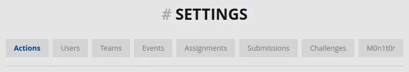
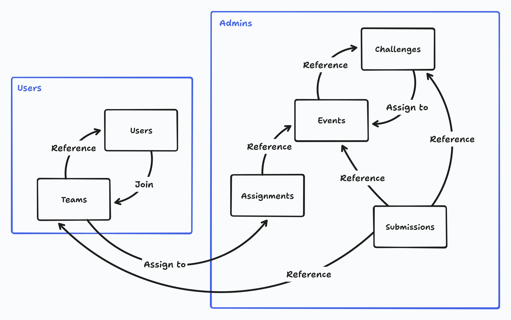
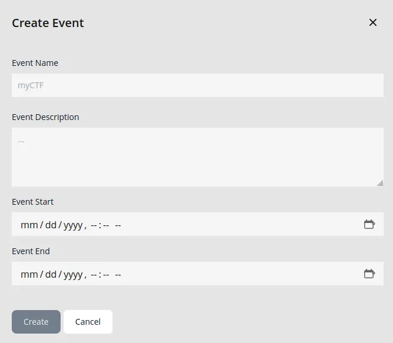
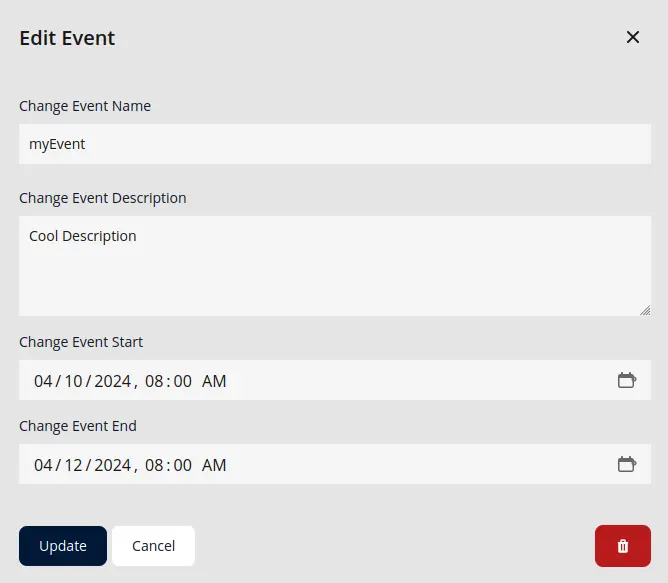
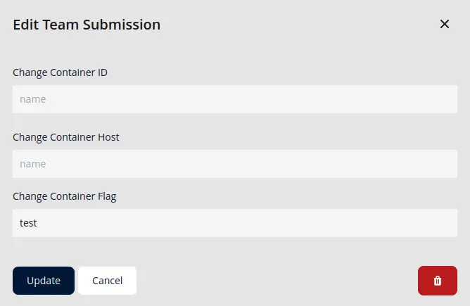
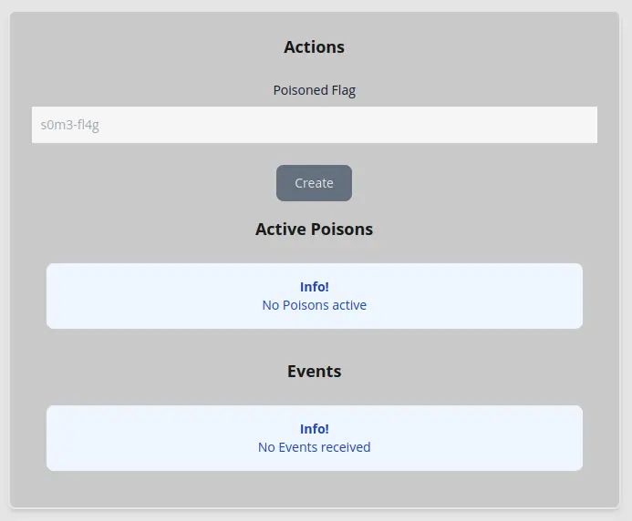
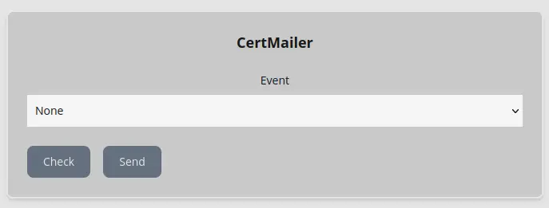

To provide the instance administrator a convenient way to manage challenges, events and users, the CTF-Citadel platform provides an Admin Panel.

The general rule of thumb when first deploying CTF-Citadel is to try out all menus and panel features beforehand, to get a feeling for how things are handled.

## Access to the Panel

The panel can be reached via the normal settings page, which will show and give access to the Admin Panel if the user is recognized with the `admin` user role in the underlying database.

To provide a general overview on how the management flow is defined on CTF-Citadel, refer to the flowchart below.

So the basic worflow would be to first create an event, then create challenges for that event which are directly assigned to it. After that is done and users have created teams, those can be assigned to the created events, which will start when the event is in the valid timerange.

Be aware that this means every challenge is directly related to an event, so one challenge can not be assigned to multiple events.

## Panel Actions

The Admin Panel is segmented into different views, which each serve a different function for managing platform data.

- Users: This lists all users currently registered.
- Teams: Lists all currently created teams on the platform.
- Events: Shows all events currently created.
- Challenges: Displays all Challenges currently created.
- Assignments: Shows the currently assigned Teams to the respective Event
- Submissions: Displays all created entries in the Database table that is used for scoring calculations

Each sub-panel has an action button in the bottom right. This allows for the creation of deletion of challenges.

Additionally, when enabled, there are two extra panels that are displayed.

- Actions: Currently housing a small utlity for sending our certificate of attendance to all users who participated in an event.
- M0n1t0r: The Anti-Cheat Dashboard for viewing events and defining new poisoned flags.

### Creating new Entities

In general, the menus and popups for adding new events and challenges are self explanatory and pretty straightforward. The webapp will check for correct input and format automatically and only allow new submissions if the input is correct and applicable.

Shown in the above example is the popup for creating new events, which will not be gone into more detail about.

### Modifying Entities

The most important thing to mention is, that challenges can almost always be modified, regardless if currently in an active event or not, because they do not have a direct tie to the event itself. Solves are partially related to challenges, but do not disallow their modification, regardless of the current solve status.

In general this is also true for events, where the administrator is able to freely modify and change active event name and description, since the platform works with `UUID`'s in the backend.

### Deleting Entities

When deleting events or challenges, the administrator has to be careful of possible relations on which the webapp can potentially fail or deny deletion.

One example would be on the deletion of a challenge that is currently in an active event **AND** has been solved by at least a team. This challenge will then have a relation to Submissions and can therefor not be deleted without deleting its dependencies, which in this case is the team/user submission of the correct flag.

Another example is event deletion, where an active event or an event that currently has challenges assigned to it, cannot be deleted.

## Altering User Submissions

For fixing or debugging purposes, the Submissions tab allows for manual management and deletion of user/team submissions and modification of the submitted flag and container ID. This can come in handy if the infra container backend has troubles during an active event and containers and challenges need to be reset and restarted.

This has been one of the most used features during the first test run of this platform and keeps hands off the underlying database, since any challenge submission that is invalid in any way can be directly deleted here. 

## Monitoring Anti-Cheat

This panel will only show up if the hosters chose to enable the Anti-Cheat integration when setting up the platform initially. It allows the administrator to view events sent by the Anti-Cheat and sned customized poisonend flags, as well as view the ones that are currently set.

No further setup of the Anti-Cheat is required as it will automatically watch every new event that is created and started, since it hooks onto submission, creation and solve events, which are event independent and tied to submissions.

## Sending Certificates 

This is the most recent integration of the platform and serves the purpose of automatically filling and sending a PDF certificate of attendance. It works on a per event basis and automatically checks which users are eligible for receiving emails.

Although this integration will check for verified emails using the database directly, it is defined as _infallible_, which means it will continure to send out emails to all users, even if some of them fail.

---

Authors: Teppan F.
